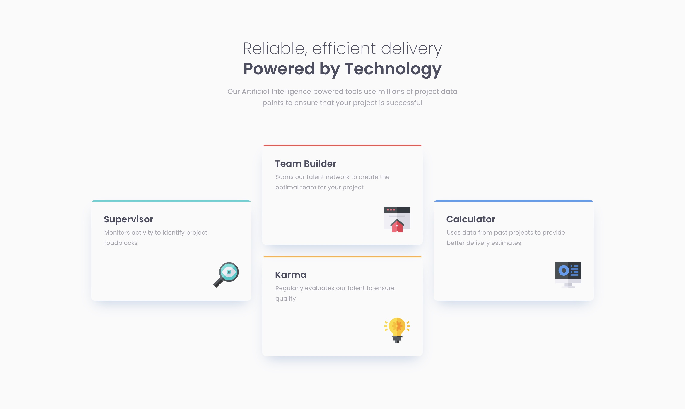

# Frontend Mentor - Four card feature section solution

This is a solution to the [Four card feature section challenge on Frontend Mentor](https://www.frontendmentor.io/challenges/four-card-feature-section-weK1eFYK). Frontend Mentor challenges help you improve your coding skills by building realistic projects. 

## Table of contents

- [Overview](#overview)
  - [The challenge](#the-challenge)
  - [Screenshot](#screenshot)
  - [Links](#links)
- [My process](#my-process)
  - [Built with](#built-with)
  - [What I learned](#what-i-learned)
- [Author](#author)

**Note: Delete this note and update the table of contents based on what sections you keep.**

## Overview

### The challenge

Users should be able to:

- View the optimal layout for the site depending on their device's screen size

### Screenshot

### Links

- Solution URL: [github.com/tloyan/frontendmentor-four-card-feature-section](https://github.com/tloyan/frontendmentor-four-card-feature-section)
- Live Site URL: [four-card-feature-section.tloyan.com](https://four-card-feature-section.tloyan.com/)

## My process

### Built with

- [React](https://react.dev/)
- [Next.js](https://nextjs.org/)
- [TypeScript](https://www.typescriptlang.org/)
- [Tailwind CSS](https://tailwindcss.com/)

### What I learned

I’ve learned that some simple things to achieve in CSS can become quite messy with Tailwind.

## Author

- Website - [Thomas Loyan](https://www.thomasloyan.com)
- Frontend Mentor - [@tloyan](https://www.frontendmentor.io/profile/tloyan)